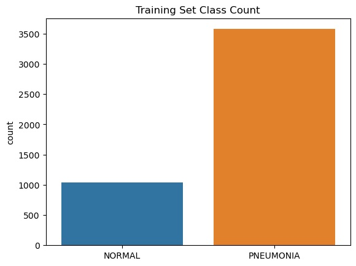
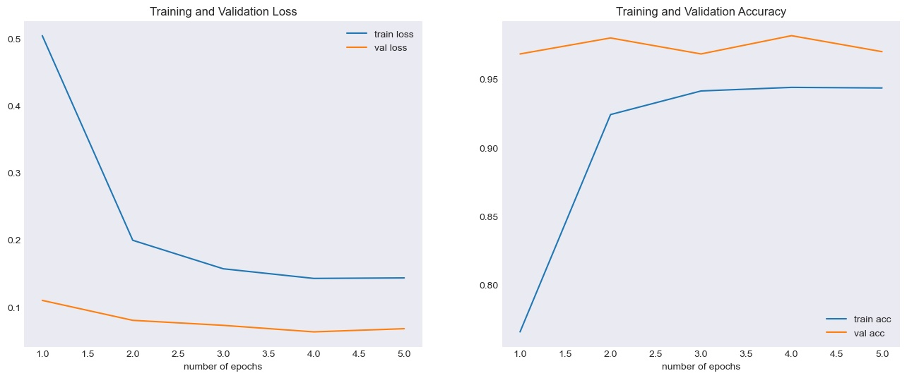

# Detecting Pneumonia with Deep Learning


**Authors** Sandra Wellbeck and Joe Marx

## Overview

Pneumonia is a viral or bacterial infection affecting the respiratory system, that begins by inflaming the air sacs in one or both of the lungs <sup>1</sup>. While symptoms of pneumonia can be mild, they can become severe if left undiagnosed and can result in death.  With a health care system under unprecented strain, any tool that can delegate a Doctor's responsibilites adds a great aount of value. Detecting pneumonia from an x-ray is difficult even for the human eye, so training a deep learning convulutional network to recognize pneumonia in an x-ray image is an effecient and effective way to ease the burden of Radiologists and help prevent cases from going undetected.

## Data


This dataset was sourced from Kaggle. It is comprised of over 5.5 thousand jpeg images of chest x-rays. Pneumonia x-images included both bacterial and viral infected cases. Pneumonia cases appear to be cloudier than normal cases, though differences are very subtle.


Images were organized into train, validation, and test folders, inside of which they were split by diagnosis. Data is not stored in this repo Approximately 75% of the images provided are labeled as pneumonia-positve cases. Class imbalance has been addressed through subtle data augmentation of the training set and setting balanced class weights when training the neural network. 

## Approach

The prediction model was built using the Keras package from Tensorflow. The model was built iteratively, through a process of metric optimization. Accuracy, precision, and recall were used to evaluate performance and Adam was used as the loss function. Our final model consists of 4 2-dimensional, 3 by 3 filter convultional layers, using a relu activation function, and a He initializer, each followed by a 2 by 2 max-pooling layer. The feature tensor is then flattenned,  run through a dropout layer, then a dense layer, again with a relu activation and He initializer function.



## Outcome

We were able to achieve 99% accuracy, 99% recall, and 98% precision on our validation set. And when tested on unseen data the model achieved 85% accuracy, 98% recall, and 82% precision. Notably, with very high recall, there are not many poisitve cases left undetected by the model. The cases would then be verified by a doctor to check for a false positive. As a next step, PCA and more sophisticated image augmentation should be implemented to improve accuracy on the unseen data.

 

```
├── README.md                      <- the top-level README for reviewers of this project
├── EDA_notebook.ipynb             <- data cleaning, EDA, feature engineering/selection
├── modeling_notebook.ipynb        <- notebook containing all elements of model
├── data                           <- dataset files
├── summary_presentation.pdf       <- a pdf of the project presentation
└── images                         <- both sourced externally and generated from code

```


## Sources
Dataset: https://www.kaggle.com/paultimothymooney/chest-xray-pneumonia

<sup>1</sup> Mayoclinic https://www.mayoclinic.org/diseases-conditions/pneumonia/symptoms-causes/syc-20354204
